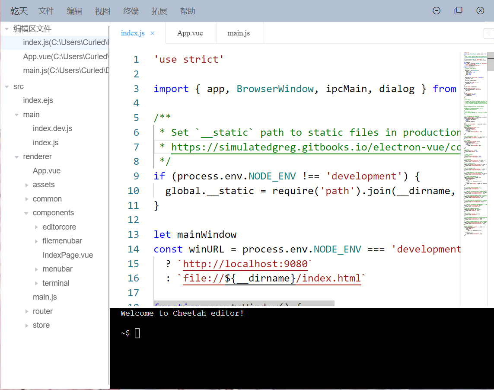

# Cheetah


## DESCRIPTION

Cheetah是一个基于Electron-vue编写的跨平台编辑器，内核基于monaco开发。



## HOW TO USE

### Windows平台

您可以直接从release下载编译好的二进制文件运行。如果要从源码安装，请进行以下步骤：

```bash
git clone https://github.com/liupuchun/C3E.git
cd C3E
#安装node9以上版本，安装对应版本的yarn或npm
yarn(npm install)
yarn build(npm build)
```

如果提示sqlite安装失败，请安装[tdm-gcc](http://tdm-gcc.tdragon.net/download)或其他gcc环境。

### Linux平台

您可以直接从release下载编译好的二进制文件运行。如果要从源码安装，请进行以下步骤：

```bash
git clone https://github.com/liupuchun/C3E.git
cd C3E
#debian/fedora/centos
apt-get install nodejs / dnf install nodejs / yum install nodejs
apt-get install yarn / dnf install yarn / yum install yarn
yarn(npm install)
yarn build(npm build)
```

## TODO

- [x] 文件打开、文件夹打开、关闭
- [x] 编辑器复制、粘贴、剪切、查找；
- [x] 根据拓展名自动应用60种高亮方案，js、html、css、ts自动补全
- [x] 编码识别与自动转换
- [ ] 终端实现
- [ ] 拓展插件
